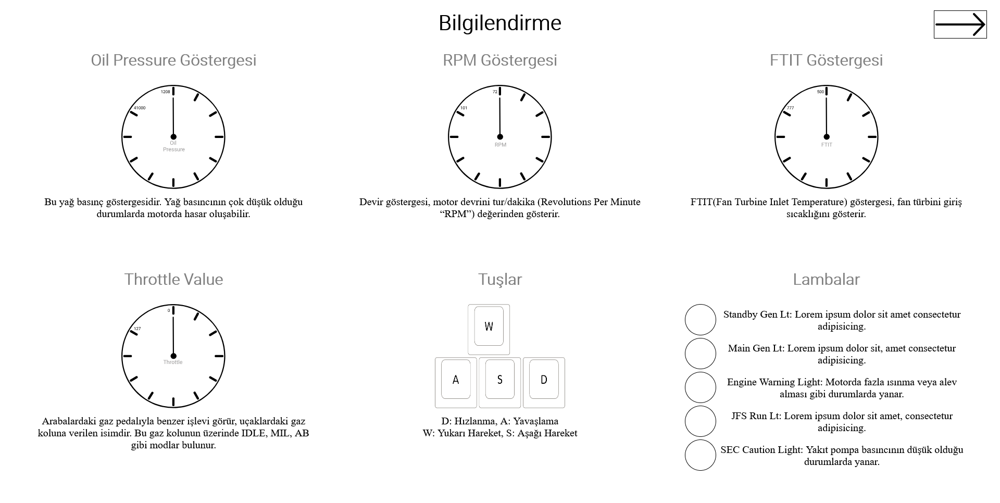
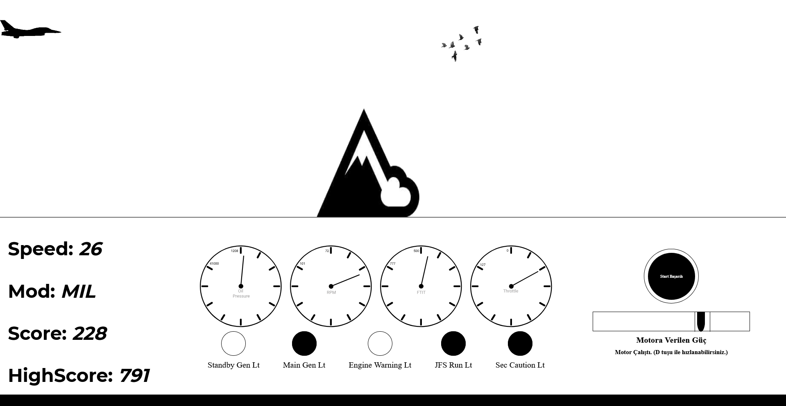

# 2D-Aircraft-Game-JS

This is a the project which I made during my internship at HAVELSAN. 
<ul>
  <li>Different indicator values according to the speed</li>
  <li>Main purpose is to escape obstacles (birds, trees, mountains)</li>
  <li>If you go faster, you get more points (top speed 127)</li>
  <li>Please use <strong>Google Chrome</strong> for a better performance</li>
  <li>The first and second pages of the website contain general information about the game</li>
</ul>
You can try the game from: https://aircraftgame2d.netlify.app/
 
 

